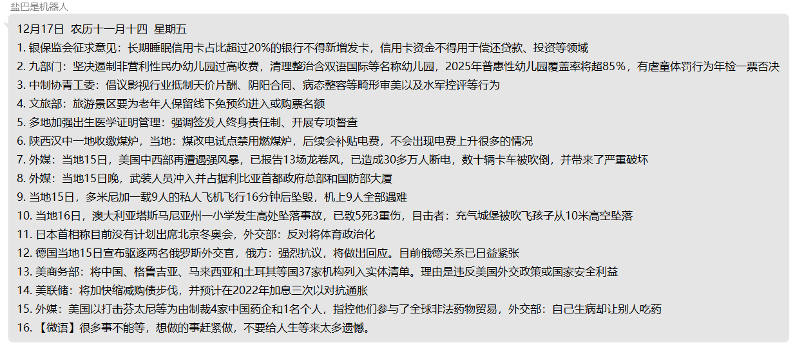

#QQ机器人定时推送

**功能实现：**  每天早上六点发送新闻。

**发送时间：**  06：00

**调用api：**  [新闻api](https://api.vvhan.com/api/60s?type=json)

**说明：**  
+ 每天定时发送新闻的时间以json格式保存在[此文件下](../../../Bot_data/Read_Time/time.json)。
+ 须在环境中添加机器人qq号。
  > bot_id=123456789
  > 

##示例
