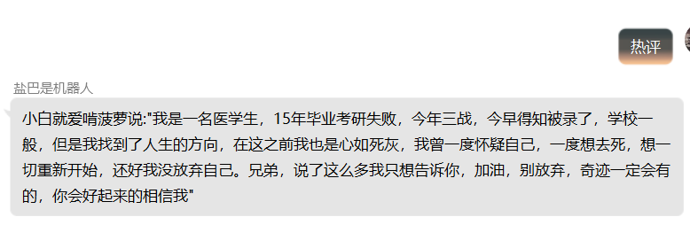

#QQ机器人随机音乐和随机热评插件
**功能实现：**  随机发送一首网易云音乐或者网易云热评。

**命令语句：**  

+ 随机音乐
+ 热评

**阻断：**  关闭。

**优先级：**  

+ 随机音乐：52。
+ 热评：53。

**调用api：**
+ [随机音乐调用api](http://api.uomg.com/api/rand.music?)
+ [随机热评调用api](https://api.uomg.com/api/comments.163?)

##示例
###示例1：随机音乐

###示例2：随机热评
